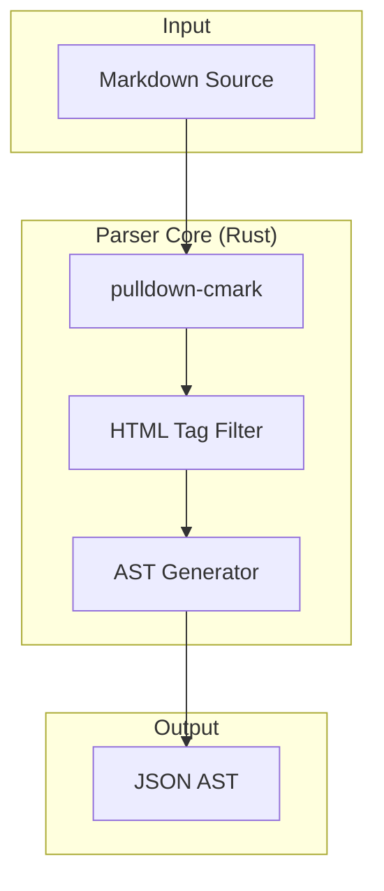

# @clevertree/md2jsx

High-performance Markdown to JSX AST transpiler for Web (WASM) and Android (JNI).

## Architecture



This library parses Markdown (including GitHub Flavored Markdown) and converts it into a JSON-serializable Abstract Syntax Tree (AST) that can be easily rendered by React, Act, or other JSX-like runtimes.

## Features

- **Fast**: Powered by Rust and `pulldown-cmark`.
- **Cross-Platform**: WASM for Web, JNI for Android.
- **HTML Support**: Supports nested HTML tags within Markdown.
- **Custom Tag Filtering**: Only renders HTML tags explicitly allowed in `allowed_tags`.
- **GFM Support**: Tables, task lists, and strikethrough enabled by default.

## Installation

### NPM (Web)

```bash
npm install @clevertree/md2jsx
```

### Maven (Android)

Add to your `build.gradle`:

```gradle
dependencies {
    implementation 'com.clevertree:md2jsx:0.1.0'
}
```

### Cargo (Rust)

```toml
[dependencies]
md2jsx = "0.1.0"
```

## Usage

### Web (WASM)

```javascript
import init, { parse_markdown } from '@clevertree/md2jsx';

async function run() {
    await init();
    const markdown = "# Hello\n<CustomBox title=\"Alert\">Content</CustomBox>";
    const options = {
        allowed_tags: ["CustomBox"]
    };
    const ast = parse_markdown(markdown, options);
    console.log(ast);
}
```

### Android (Kotlin)

```kotlin
val parser = Md2JsxParser()
val markdown = "# Hello"
val options = TranspileOptions(allowedTags = listOf("CustomBox"))
val astJson = parser.parse(markdown, options)
```

## AST Structure

The output is a list of nodes:

```json
[
  {
    "type": "element",
    "tag": "h1",
    "props": {},
    "children": [
      { "type": "text", "content": "Hello" }
    ]
  }
]
```

## License

MIT OR Apache-2.0
